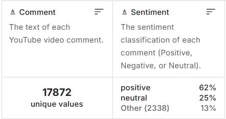
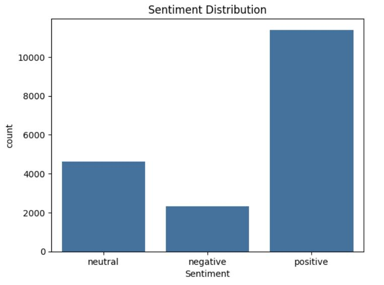
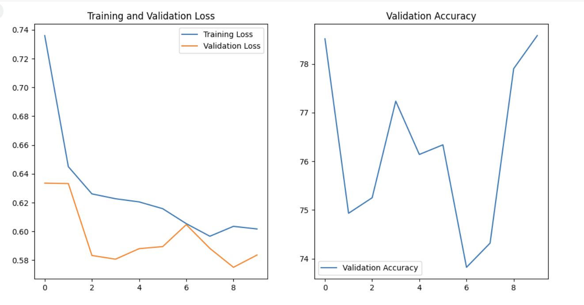
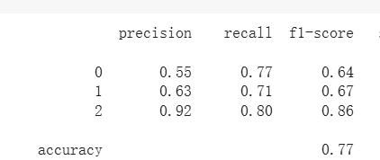
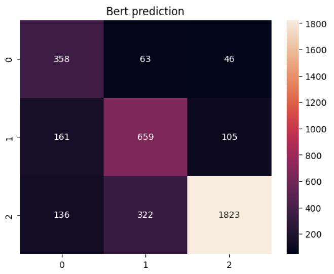

# Final Project Report

## Students Information
**Group members:** Yufan Liu, Gordon Yang

---

## GitHub Repository
[https://github.com/6yufan/RealTimeML-Final-Project](https://github.com/6yufan/RealTimeML-Final-Project)

---

## 1. **Introduction and Motivation**
Sentiment analysis is widely applied in social media monitoring, customer feedback, and marketing. While BERT's deep understanding of context makes it ideal for this task compared to traditional ML approaches.

## 2. **Approach**
In this project, we use a pre-trained BERT model to classify the sentiment of given texts. The dataset used consists of labeled text samples indicating sentiment.

- ### **2.1 Data preprocessing**
- #### Train-Test Split(80%/20%)
- #### Count and plot the sentiment data distribution
- #### Set truncation to limit the max length of text
- #### Turns raw strings into padded input_ids and attention_mask tensors
- #### Custom Dataset wrapper
- #### Instantiate datasets & loader

- ### **2.2 Model Architecture**
- #### **Encoder:** LabelEncoder (sklearn.preprocessing.LabelEncoder)
- #### **Decoder:** BERT (transformers.BertModel.from_pretrained("google-bert/bert-base-uncased"))

## **3 Dataset and Training Setup**

- ### **3.1 Dataset**

We used the YouTube Comments Dataset(from Kaggle) containing 17,872 labeled samples. It was split into training and validation sets, the following graphs show the structure of the dataset. 

- **Fig-3.1 YouTube Comments Dataset:**  
  
- **Fig-3.1 Sentiment Distribution of the dataset:**  
  

- ### **3.2 Training Setup**
  - #### **Batch size:** 32
  - #### **Epochs:** 10
  - #### **Learning rate:** 2e-5
  - #### **Loss:** CrossEntropyLoss
  - #### **Optimizer:** AdamW
  
## 4. **Results and Analysis**
- **Fig-4.1 Training and validation results:**  
  
- **Fig-4.2 Classification report:**  
  
- **Fig-4.3 Confusion matrix:**  
  

- #### We present loss table, a confusion matrix, and metrics like F1-score to evaluate performance.
- #### The training and validation loss continue to decrease, but the validation loss keeps fluctuating, it may caused by overfitting, the model is learning the training data very well, including noise, but fails to generalize.

## 5. **Lesson Learned**
- #### The model shows strong performance in detecting positive sentiment (class 2), with a high F1-score of 0.86, driven by both high precision (0.92) and solid recall (0.80).
- #### It performs moderately well on negative sentiment (class 1), with a balanced F1-score of 0.67.
- #### However, performance on neutral sentiment (class 0) is weaker, with a lower precision (0.55) and F1-score (0.64), suggesting the model tends to confuse neutral with other classes.
